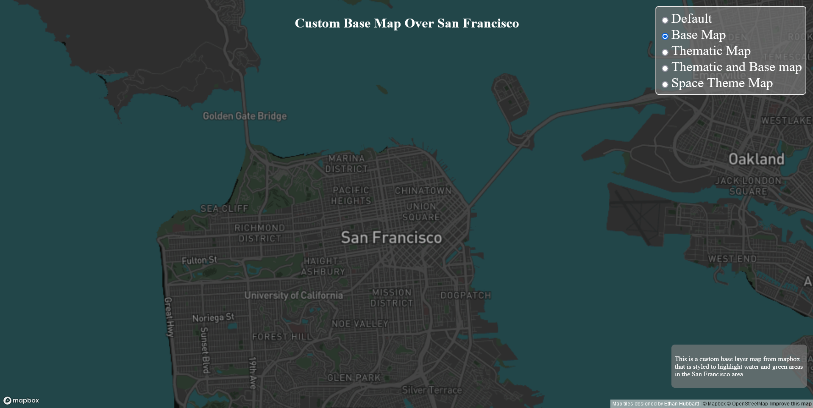

https://ehubbartt.github.io/lab4/

**Here is the first Layer**

This layer shows a base map with generated tiles that was styled and created using mapbox. It is centered over San Francisco, California. The zoom levels is from 0 - 12.

**Here is the second Layer**

This layer shows a thematic tile set that shows locations of green roofs in San Francisco. The zoom levels is from 0 - 12.

**Here is the third Layer**

This layer is a combination of the first and second layer. The zoom levels is from 0 - 12.

**Here is the fourth Layer**

This layer is a space themed layer that was styled and created using mapbox. The color scheme is based off the colors in the milkyway galaxy. The zoom levels is from 0 - 12.
